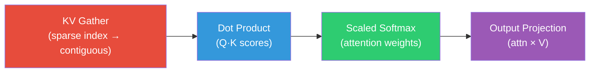

# DSA Kernel Profiling Guide — Full Decision Tree

## Overview

This profiling pipeline implements the **measure → identify → fix → re-measure** workflow for the DeepSeek Sparse Attention (DSA / MLA) CUDA kernels on the Blackwell B200.

## Files

| File | Purpose |
|---|---|
| [profile_dsa.sh](file:///home/rrongali/llm-sys-project/profiling/profile_dsa.sh) | Main orchestrator (3 stages) |
| [diagnose_moe.py](file:///home/rrongali/llm-sys-project/profiling/diagnose_moe.py) | Shared decision-tree analyzer (kernel-agnostic) |
| [Makefile](file:///home/rrongali/llm-sys-project/Makefile) | `profile_dsa*` targets |

## The DSA Attention Pipeline



### Kernel Variants Across Optimization Levels

| Stage | Naive | Opt1 (Tiled) | Opt2 (Fused Dot) | Opt3 (Flash) | Opt4 (Pipelined) |
|---|---|---|---|---|---|
| **Gather** | `kv_gather_fused_kernel` | same | same | *fused into flash* | *fused into flash* |
| **Dot (Compressed)** | `dot_compressed_kernel` | `dot_compressed_tiled_kernel` | *fused* | *fused into flash* | *fused into flash* |
| **Dot (Positional)** | `dot_positional_kernel` | `dot_positional_tiled_kernel` | `dot_fused_tiled_kernel` | *fused into flash* | *fused into flash* |
| **Softmax** | `scaled_softmax_kernel` | same | same | *online softmax in flash* | *online softmax in flash* |
| **Output Proj** | `output_proj_kernel` | same | same | *fused into flash* | *fused into flash* |
| **Flash Kernel** | — | — | — | `dsa_flash_fused_kernel` | `dsa_blackwell_pipelined_fused_kernel` |

## Quick Start

```bash
# Full pipeline: nsys → ncu → diagnosis
make profile_dsa

# Individual stages
make profile_dsa_nsys    # Stage 1: Timeline — find slow kernel
make profile_dsa_ncu     # Stage 2: Deep metrics on all kernels  
make profile_dsa_diag    # Stage 3: Parse results into diagnosis
```

### Direct script usage

```bash
# Profile a specific stage
./profiling/profile_dsa.sh --variant Opt4 --stage 2

# Just run diagnosis on existing data
./profiling/profile_dsa.sh --stage 3
```

## DSA-Specific Profiling Focus Areas

> [!IMPORTANT]
> DSA kernels have fundamentally different bottleneck profiles than MoE kernels.
> MoE is dominated by **large GEMMs** (compute-heavy). DSA is dominated by **scattered
> memory access** to the KV cache and **many small dot products**.

### 1. KV Gather Kernel — Likely **Memory-Bound**

The gather kernel reads from the KV cache using **sparse indices** (random access pattern).

**What to look for:**
- **Coalescing**: `sectors/request` ratio will likely be high (random access = un-coalesced)
- **L2 hit rate**: Sparse indices cause cache thrashing → expect low L2 hit rate
- **Achieved bandwidth**: Far below peak due to random access

**Potential fixes:**
- Sort sparse indices before gather → improves spatial locality
- Use vectorized loads (`float4`) for the Dc-dimension copy
- Prefetch with `cp.async` to overlap data staging

### 2. Dot Product Kernels — **Mixed Memory/Compute**

These compute `Q·K` scores. The bottleneck depends on head dimensions:
- **Small Dp (64)**: Very few FLOPs per element → memory-bound
- **Large Dc (512)**: More FLOPs, may approach compute-bound

**What to look for:**
- **Bank conflicts**: Tiled kernels load key tiles into shared memory
- **Warp stall (long scoreboard)**: If waiting for global memory loads
- **FMA utilization**: Check if `ffma` dominates the instruction mix

### 3. Flash Fused Kernel — Likely **Latency-Bound**

The flash kernel fuses everything into one block per (query, head). It uses large shared memory buffers.

**What to look for:**
- **Occupancy**: Huge smem allocation (~72 KB for Dc=512) → very few blocks per SM
- **Warp stalls (wait)**: Heavy `__syncthreads()` usage between tile loads and compute
- **Warp stalls (long scoreboard)**: Random KV cache access within the kernel
- **Registers per thread**: Flash kernels maintain online softmax state → register heavy

**Potential fixes:**
- Reduce `FLASH_S_TILE` to lower smem → trade reuse for occupancy
- Use `__launch_bounds__` to cap register usage
- Split head dimensions across warps for better parallelism

### 4. Double-Buffered Pipelined Kernel — **Targeting Latency Hiding**

Same as flash but overlaps tile N+1 prefetch with tile N compute.

**What to look for:**
- **Smem doubles** (2× the flash kernel) → even lower occupancy
- **Stall reduction**: Compare `long_scoreboard` stall % vs Opt3 flash
- **Achieved bandwidth**: Should be closer to peak if prefetching works

## Decision Tree for DSA

```
Profile with nsys
  → Which kernel is slowest?
      → If gather: focus on memory access pattern
      → If dot_compressed: focus on Dc dimension tiling efficiency
      → If dot_positional: focus on Dp=64 (very small — may be launch-overhead bound)
      → If flash/pipelined: focus on smem pressure + occupancy

Profile slow kernel with ncu
  → Check Roofline
      → Memory bound? (likely for gather, dot with small dims)
          → coalescing (gather is random access → BAD)
          → L2 hit rate (sparse indices → probably LOW)
          → achieved bandwidth vs 8 TB/s peak (B200)
      → Compute bound? (possible for large-Dc dot products)
          → tensor core utilization (currently 0% — FP32 only)
          → instruction mix (FFMA ratio)
      → Below both roofs? (likely for flash kernels)
          → occupancy (smem is the limiter — 72-144 KB)
          → warp stalls: long_scoreboard vs wait vs short_scoreboard
          → check if barrier stalls dominate (too many __syncthreads)
```

## Metrics Cheatsheet (DSA-Specific Focus)

| Concept | Metric | DSA Relevance |
|---|---|---|
| Coalescing | `sectors/requests` | **Critical for gather** — random access |
| Bank conflicts | `l1tex__data_bank_conflicts_*` | Important for tiled dots |
| L1 hit rate | `l1tex__t_sector_hit_rate` | Check tiled kernels |
| L2 hit rate | `lts__t_sector_hit_rate` | **Critical for gather** — sparse access |
| Occupancy | `achieved_occupancy` | **Critical for flash** — huge smem |
| Barrier stalls | `stalled_wait` | Flash kernels sync heavily |
| GMEM stalls | `stalled_long_scoreboard` | All kernels — KV cache latency |
| Block size | `launch__block_size` | Flash uses 128 threads |
| Dynamic smem | `launch__shared_mem_per_block_dynamic` | Flash: ~72KB, Pipelined: ~144KB |
| Registers | `launch__registers_per_thread` | Flash online softmax state |

## The Golden Rule

> [!IMPORTANT]
> **Don't optimize blindly.** The workflow is always:
> 1. **Measure** → identify binding constraint
> 2. **Fix that one thing**
> 3. **Measure again** — the bottleneck often shifts after each fix
>
> For DSA specifically: the bottleneck often **shifts from gather (memory) → flash occupancy (latency)**
> as you fuse kernels. Fixing gather coalescing won't help if flash occupancy is the new bottleneck.
