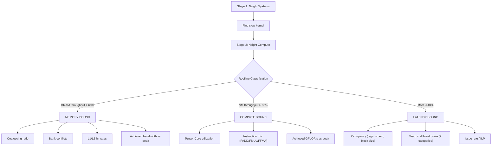

# MoE Kernel Profiling Guide

## Overview

This profiling pipeline implements the **measure → identify → fix → re-measure** loop for MoE CUDA kernels on the Blackwell B200. It uses NVIDIA Nsight Systems for timeline analysis and Nsight Compute for deep kernel metrics.

> [!IMPORTANT]
> **Don't optimize blindly.** Always measure first, identify the binding constraint, fix that one thing, then measure again. The bottleneck often shifts after each fix.

## Profiling Infrastructure

| File | Purpose |
|---|---|
| `profiling/profile_moe.sh` | Main profiling orchestrator (3 stages) |
| `profiling/diagnose_moe.py` | Automated decision-tree bottleneck analyzer |
| `profiling/analyze_ncu.py` | Lightweight NCU CSV parser (for simple kernels) |
| `benchmarks/bench_moe_smoke.cu` | NVTX-instrumented smoke benchmark for profiling |

## Quick Start

```bash
# On B200 via Modal:
modal run modal_run.py --target profile_moe_1    # Stage 1: Timeline
modal run modal_run.py --target profile_moe_2    # Stage 2: Deep metrics
modal run modal_run.py --target profile_moe_full # Runs 1 & 2, fetches files, runs diagnosis
```

### The Auto-Fetch Pipeline
When you execute profiling via `modal_run.py`, the system generates a unique **`RUN_ID`**. 
1. The `RUN_ID` is passed inside the cloud container to guarantee all tools output uniformly named files.
2. The massive `.ncu-rep` and `.sqlite` binaries are saved permanently on the cloud volume `llm-sys-profiling-results`.
3. `modal_run.py` **automatically downloads** those artifacts to your local `./profiling/local_results/` folder as soon as the run is completed.
4. You run your analysis tools (like `diagnose_moe.py`) locally on the fetched CSV.

Or invoke the script directly:

```bash
./profiling/profile_moe.sh --variant Opt5 --stage 1
./profiling/profile_moe.sh --variant Opt3 --stage 2
./profiling/profile_moe.sh --stage 3
```

## The Decision Tree



## Stage Details

### Stage 1: Nsight Systems (Timeline)

**Goal**: Find which kernel dominates wall-clock time.

Runs `nsys profile` on the smoke benchmark. Generates a `.nsys-rep` file and prints kernel-by-kernel GPU time and CUDA API summaries.

**Trace modes**:
- `--trace=cuda,nvtx,osrt` — Standard software-instrumented trace. Works everywhere.
- `--trace=cuda-hw,nvtx,osrt` — Blackwell hardware trace. Lower overhead, ±10ns precision. **Use one or the other, never combine `cuda` and `cuda-hw`.**

**What to look for**:
- Which kernel has the highest total GPU time
- Gaps between kernels (CPU-side overhead / synchronization)
- `cudaMemcpy` calls inside the benchmark loop (unnecessary transfers)

### Stage 2: Nsight Compute (Deep Dive)

**Goal**: Classify each kernel and find the root cause.

Collects ~30 metrics organized into 4 groups:

| Group | Key Metrics | Classification Rule |
|---|---|---|
| **Roofline** | `sm__throughput`, `gpu__dram_throughput` | DRAM > 60% → memory-bound; SM > 60% → compute-bound |
| **Memory** | Coalescing ratio, bank conflicts, L1/L2 hit rates, achieved BW | Diagnoses *why* memory is slow |
| **Compute** | Tensor Core %, instruction mix, achieved GFLOP/s | Diagnoses *why* compute is slow |
| **Latency** | Occupancy, 7 warp stall categories, issue rate | Diagnoses *why* the GPU is underutilized |

Uses `--launch-skip 50 --launch-count 20` to skip warmup kernel launches and profile only steady-state iterations.

### Stage 3: Automated Diagnosis (Local Analysis)

**Goal**: Parse NCU metrics through the decision tree and output a human-readable report without executing another cloud container.

After the auto-fetch downloads your results, you process them locally:
```bash
python3 profiling/diagnose_moe.py profiling/local_results/moe_Opt5_<RUN_ID>_ncu.csv
```

`diagnose_moe.py` parses the CSV and for each kernel:
1. Translates `ms`/`us`/`ns` execution timings.
2. Classifies it via roofline thresholds.
3. Drills down into the appropriate analysis branch.
4. Identifies the dominant bottleneck and recommends a fix.

## Metrics Cheatsheet

| Concept | Metric | Bad Threshold |
|---|---|---|
| Coalescing | `l1tex__t_sectors / requests` | > 4 sectors/request |
| Bank conflicts | `l1tex__data_bank_conflicts_*` | > 1000 total |
| L1 hit rate | `l1tex__t_sector_hit_rate` | < 50% |
| L2 hit rate | `lts__t_sector_hit_rate` | < 50% |
| Occupancy | `sm__warps_active` | < 50% |
| Tensor cores | `sm__pipe_tensor_cycles_active` | < 5% (unused) |
| Issue rate | `smsp__issue_active` | < 30% |
| DRAM bandwidth | `dram__bytes / duration` | vs 8 TB/s peak (B200) |

## NVTX Instrumentation

The smoke benchmark (`bench_moe_smoke.cu`) is instrumented with NVTX ranges:
- `warmup` — wraps all warmup iterations
- `bench_<Variant>` — wraps the timed benchmark loop for each variant
- `<Variant>_iter_<N>` — wraps each individual iteration

This enables:
- Filtering warmup out of Nsight Systems timelines
- Targeted NCU profiling of specific iterations (via `--launch-skip`/`--launch-count`)

## External Resources

- **Nsight Systems User Guide (local)**: `docs/external/nsight_systems_user_guide.html`
- **Nsight Systems Docs**: https://docs.nvidia.com/nsight-systems/UserGuide/index.html
- **Nsight Compute Docs**: https://docs.nvidia.com/nsight-compute/NsightCompute/index.html
