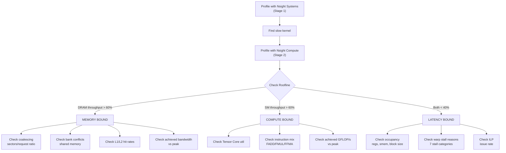

# MoE Kernel Profiling Guide — Full Decision Tree

## Overview

This profiling pipeline implements the **measure → identify → fix → re-measure** workflow for your MoE CUDA kernels on the Blackwell B200.

## Files Created

| File | Purpose |
|---|---|
| [profile_moe.sh](file:///home/rrongali/llm-sys-project/profiling/profile_moe.sh) | Main orchestrator (3 stages) |
| [diagnose_moe.py](file:///home/rrongali/llm-sys-project/profiling/diagnose_moe.py) | Automated decision-tree analyzer |
| [Makefile](file:///home/rrongali/llm-sys-project/Makefile) | New `profile_moe*` targets |

## The Decision Tree



## Quick Start

### On the B200 (via Modal or direct SSH)

```bash
# Full pipeline: nsys → ncu → diagnosis
make profile_moe

# Individual stages
make profile_moe_nsys    # Stage 1: Timeline — find slow kernel
make profile_moe_ncu     # Stage 2: Deep metrics on all kernels  
make profile_moe_diag    # Stage 3: Parse results into diagnosis
```

### Direct script usage

```bash
# Profile only Opt3 variant
./profiling/profile_moe.sh --variant Opt3 --stage 2

# Just run diagnosis on existing data
./profiling/profile_moe.sh --stage 3
```

## Stage Details

### Stage 1: Nsight Systems (Timeline)

**Goal**: Find which kernel dominates wall-clock time.

**What it does**:
- Runs `nsys profile` on the benchmark binary
- Generates `.nsys-rep` file (open in Nsight Systems GUI)
- Prints kernel-by-kernel GPU time summary
- Prints CUDA API call summary (shows host-side overhead)

**What to look for**:
- Which kernel name appears with the highest total GPU time
- Large gaps between kernels (= CPU-side overhead / synchronization)
- `cudaMemcpy` calls (= unnecessary host-device transfers in the loop)

### Stage 2: Nsight Compute (Deep Dive)

**Goal**: Classify each kernel and find the root cause.

**Metrics collected** (40+ metrics in 4 groups):

````carousel
### Group A: Roofline Classification
| Metric | What it tells you |
|---|---|
| `sm__throughput` | Overall SM utilization (%) |
| `gpu__dram_throughput` | DRAM bandwidth utilization (%) |
| `gpu__compute_memory_throughput` | Combined throughput |

**Rule**: If DRAM > 60% → memory-bound. If SM > 60% → compute-bound. Both low → latency-bound.
<!-- slide -->
### Group B: Memory-Bound Deep Dive
| Metric | What it tells you |
|---|---|
| `l1tex__t_sectors / requests` | Coalescing efficiency |
| `l1tex__data_bank_conflicts_*` | Shared memory bank conflicts |
| `l1tex__t_sector_hit_rate` | L1 cache hit rate |
| `lts__t_sector_hit_rate` | L2 cache hit rate |
| `dram__bytes_read/write` | Achieved bandwidth |

**Key ratio**: sectors/request should be ≤ 4 for coalesced access.
<!-- slide -->
### Group C: Compute-Bound Deep Dive
| Metric | What it tells you |
|---|---|
| `sm__pipe_tensor_cycles_active` | Tensor Core utilization |
| `sm__sass_thread_inst_executed_op_ffma` | FMA instruction count |
| `FLOP/duration` | Achieved GFLOP/s |

**Key check**: If tensor_core_pct < 5%, you're leaving massive performance on the table.
<!-- slide -->
### Group D: Latency-Bound Deep Dive
| Metric | What it tells you |
|---|---|
| `achieved_occupancy` | Active warps vs max |
| `launch__registers_per_thread` | Register pressure |
| `launch__shared_mem_per_block_*` | Shared memory pressure |
| `smsp__warps_issue_stalled_*` | 7 stall categories |
| `smsp__issue_active` | ILP / issue rate |

**Stall categories**:
- **Long Scoreboard**: Waiting for global memory → needs prefetching
- **Short Scoreboard**: Waiting for L1/smem → bank conflicts or latency
- **Wait**: `__syncthreads()` barriers → reduce sync points
- **Math Pipe Throttle**: Compute pipe full → already compute-saturated
- **MIO Throttle**: Memory pipe full → use vectorized loads
````

### Stage 3: Automated Diagnosis

**Goal**: Walk the decision tree automatically and output a human-readable report.

The Python script (`diagnose_moe.py`) parses the ncu CSV export and for each kernel:
1. **Classifies** it via roofline thresholds
2. **Drills down** into the appropriate analysis branch
3. **Identifies** the dominant bottleneck
4. **Recommends** specific fixes

> [!TIP]
> Output includes a visual warp stall breakdown with bar charts, making it easy to spot the dominant stall at a glance.

## Metrics Cheatsheet

| Concept | Nsight Compute Metric | Threshold |
|---|---|---|
| Coalescing | `l1tex__t_sectors / requests` | > 4 = bad |
| Bank conflicts | `l1tex__data_bank_conflicts_*` | > 1000 = high |
| L1 hit rate | `l1tex__t_sector_hit_rate` | < 50% = low |
| L2 hit rate | `lts__t_sector_hit_rate` | < 50% = low |
| Occupancy | `achieved_occupancy` | < 50% = low |
| Tensor cores | `sm__pipe_tensor_cycles_active` | < 5% = unused |
| ILP | `smsp__issue_active / active_cycles` | < 30% = low |
| DRAM BW | `dram__bytes / duration` | vs peak (8 TB/s on B200) |

## The Golden Rule

> [!IMPORTANT]
> **Don't optimize blindly.** The workflow is always:
> 1. **Measure** → identify binding constraint
> 2. **Fix that one thing**
> 3. **Measure again** — the bottleneck often shifts after each fix
>
> Fixing a non-binding constraint does nothing. Roofline tells you which roof you're hitting. Stall analysis tells you why.
